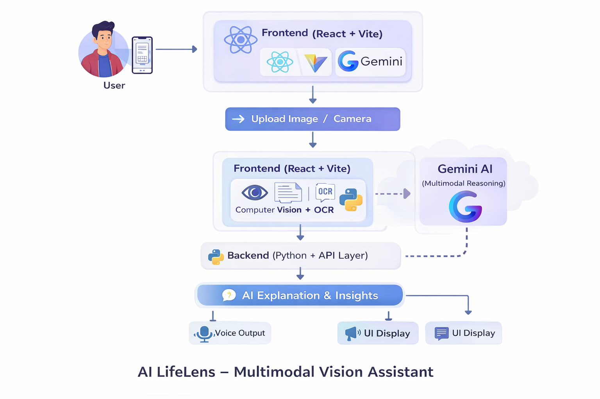
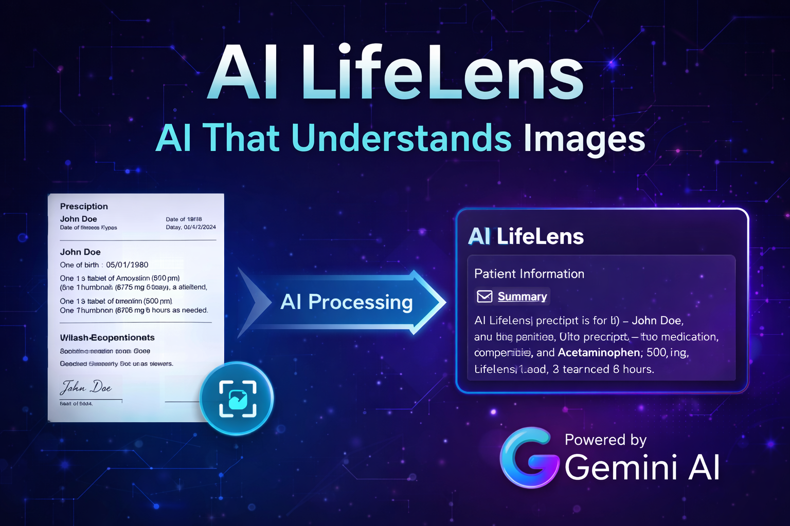

# AI LifeLens – Multimodal Vision Assistant

AI LifeLens is a multimodal AI assistant powered by **Google Gemini** that helps users understand complex visual information instantly.  
The system analyzes images, detects objects, extracts text using OCR, and generates intelligent explanations using Gemini's multimodal reasoning.

---

# Problem

People often struggle to interpret visual information such as:

- Medical prescriptions
- Product instructions
- Printed documents
- Complex real-world scenes

Existing tools may detect objects or extract text, but they lack **contextual understanding of the image**.

---

# Solution

AI LifeLens solves this problem by combining:

- Computer Vision
- OCR (Optical Character Recognition)
- Gemini Multimodal AI

The system transforms visual information into **clear explanations and actionable insights**.

---

# Key Features

- Image understanding using computer vision
- OCR text extraction from prescriptions and documents
- Gemini-powered contextual explanation
- Voice interaction support
- Real-time image analysis

---

# System Architecture

User → Upload Image / Camera  
↓  
Frontend (React + Vite)  
↓  
Image Processing Layer  
↓  
Computer Vision + OCR  
↓  
Gemini AI (Multimodal Reasoning)  
↓  
AI Explanation & Insights  
↓  
Voice Output / UI Display

---
## System Architecture

The architecture of AI LifeLens integrates computer vision, OCR, and Gemini AI to transform visual information into intelligent insights.


---

## Project Overview

The overview of AI LifeLens solves real time problems.


---

# Tech Stack

Frontend
- React
- Vite
- HTML
- CSS
- JavaScript

Backend
- Python
- Flask

AI Technologies
- Google Gemini API
- Computer Vision
- OCR (Tesseract)

Tools & APIs
- Web Camera API
- Speech Recognition

---

# Demo Video

Watch the project demo here:

https://youtu.be/5Hnk5hhxRBc

---

# Reproducible Setup Instructions

Follow these steps to run the project locally.

## 1. Clone the Repository

## 2. Install Backend Dependencies

Make sure Python 3.9+ is installed.

```bash
pip install -r requirements.txt
```

---

## 3. Install Frontend Dependencies

Make sure Node.js is installed.

```bash
npm install
```

---

## 4. Set Up Gemini API Key

Create a `.env` file in the project root and add your Gemini API key.

```
GEMINI_API_KEY=your_api_key_here
```

You can obtain an API key from:

https://ai.google.dev/

---

## 5. Run Backend Server

Start the backend server.

```bash
python app.py
```

The backend will run at:

```
http://localhost:5000
```

---

## 6. Run Frontend

Start the frontend development server.

```bash
npm run dev
```

The application will start at:

```
http://localhost:5173
```

---

## 7. Using the Application

1. Upload an image or capture one using the camera  
2. The system extracts text and visual information  
3. Gemini analyzes the image content  
4. AI LifeLens generates an explanation and insights  
5. The results are displayed in the interface

---

## Demo

Watch the project demo:

https://youtu.be/5Hnk5hhxRBc

---

## Built With

- Python  
- React  
- Vite  
- Computer Vision  
- OCR (Tesseract)  
- Google Gemini API  
- Web Camera API  
- Speech Recognition  

---

## Author

Vikash Kumar  

Portfolio  
https://vikash-kumar-984.github.io/Vikash-Portfolio/

GitHub  
https://github.com/Vikash-Kumar-984

LinkedIn  
https://www.linkedin.com/in/vikash-kumar-a071a0205/

---

## License

This project is developed for educational and innovation purposes.

```bash
git clone https://github.com/Vikash-Kumar-984/AI-LifeLens.git
cd AI-LifeLens
